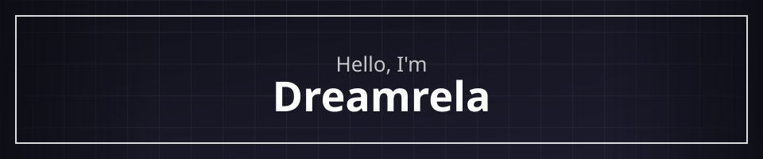

 

## Dreamrela

Backend & Minecraft developer, focused on clean systems and solid infrastructure.

Currently working on: ranked matchmaking + queue reliability for a live BedWars network.

 

## Projects

**CRBW Bot** — Discord bot (Java/JDA) powering a competitive Minecraft ranked BedWars ecosystem.

- Velocity proxy layer for cross-server session and queue handling
- LuckPerms, PlaceholderAPI, and ProtocolLib integration for ranks, placeholders, and skin handling
- SQLite-backed storage (migrated off YAML for reliability under load)
- Custom cosmetic nick plugin — skin-swap via ProtocolLib without touching player identity, so queueing stays correctly keyed
- Screenshare + punishment systems with per-source ban tracking and rate-limited cooldowns

 

## Tech Stack

 

## GitHub Stats

 

## Contact

 

